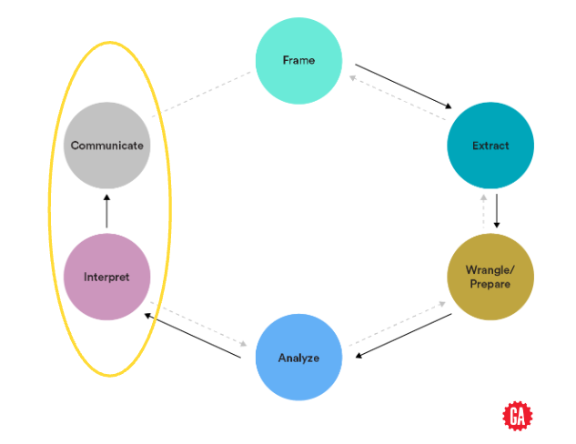

<h1>
  Data Visualization with Pandas
  Intro to Data Visualization
</h1>

**Learning objective:** By the end of this lesson, students will be able to understand where data visualization fits into a data analytics workflow.

| Lesson                      | Duration |
| --------------------------- | -------- |
| Intro to Data Visualization | 5 min    |

## Our Learning Goals

- Explain the characteristics of a great data visualization.
- Identify when to use a bar chart, pie chart, line chart, scatterplot, or histogram.
- Use Pandas to implement line charts, bar charts, scatterplots, and histograms.

## The Data Analytics Workflow

- **Interpret:** Leverage your analysis to make decisions and recommendations.
- **Communicate:** Present data-driven findings and insights in a compelling manner.

