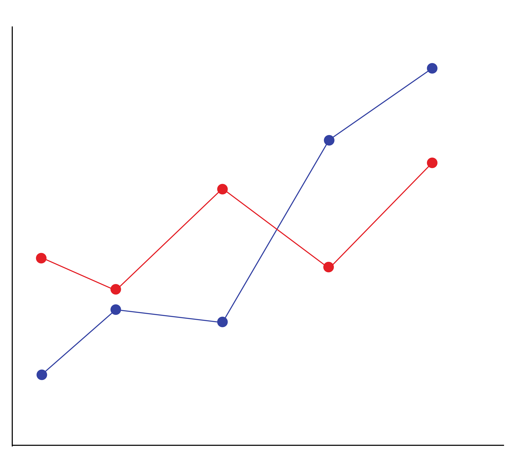
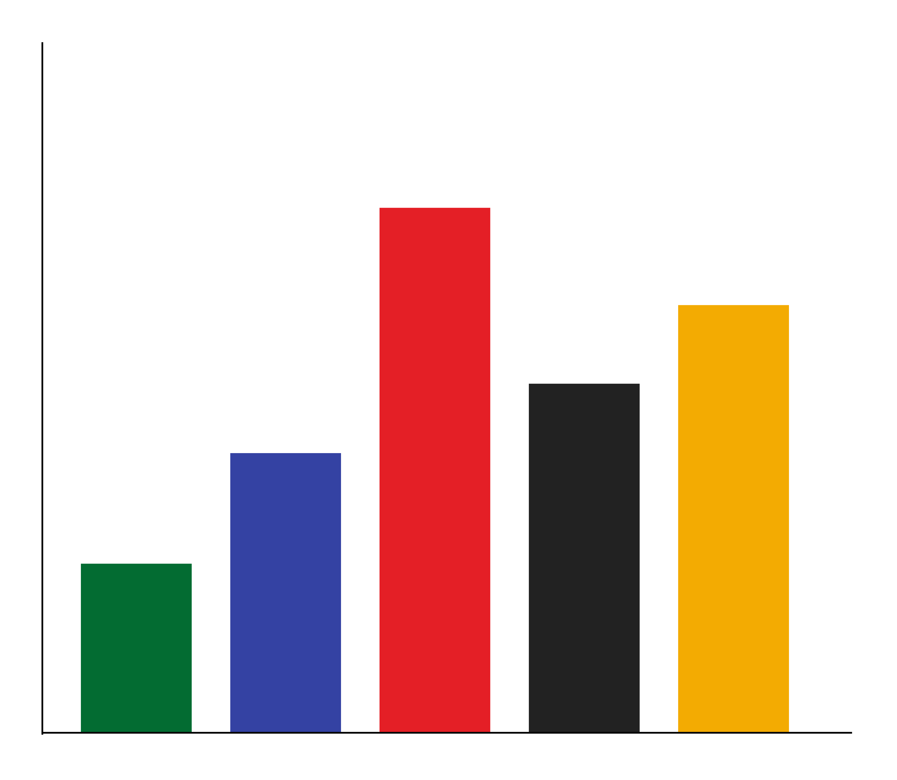
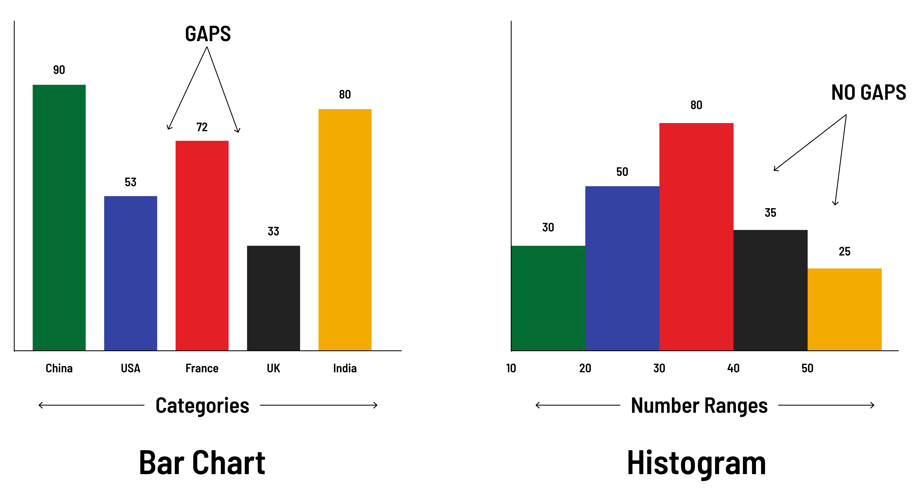
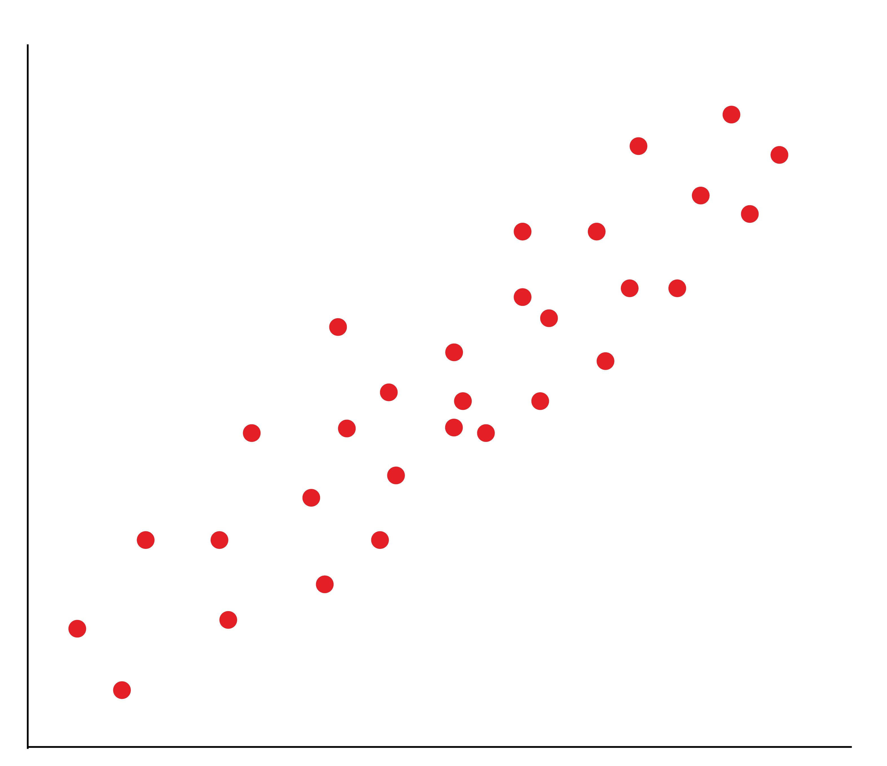
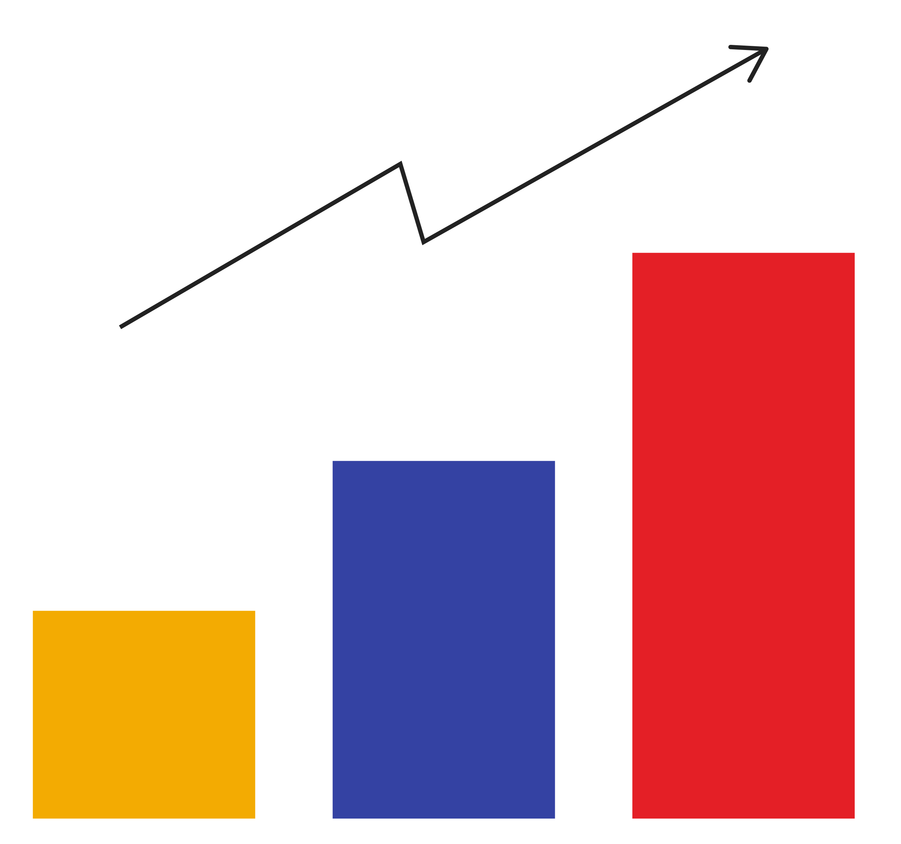

<h1>
  <span class="headline">Data Visualization with Pandas</span>
  <span class="subhead">Using Pandas to Visualize Data</span>
</h1>

**Learning objective:** By the end of this lesson, students will be able to create and customize various types of data visualizations using Pandas, including line charts, bar charts, histograms, and scatterplots. They will also learn how to choose the appropriate visualization based on the data and the story they wish to tell.

| Lesson                         | Duration |
| ------------------------------ | -------- |
| Using Pandas to Visualize Data | 80 min   |

## Pandas + Matplotlib

Pandas DataFrame objects use another library, known as [Matplotlib](https://matplotlib.org/), behind the scenes.

This means you can use Matplotlib functions in combination with Pandas methods to alter plots after drawing them.

For example, you can use Matplotlib’s `xlabel()` and `title()` functions to label the plot’s x-axis and title, respectively, after it is drawn.

> 💡 When researching how to get something done with Pandas visualizations, you can look into Matplotlib's functionality as well. You might find more specific customizations for your plots by looking in the Matplotlib documentation instead of the Pandas documentation (although Pandas’ is pretty thorough).

## The Plot Thickens

As we explore different types of plots, notice:

1. **Different types of plots are drawn very similarly** — they even tend to share parameter names.

2. In Pandas, **calling `plot()` on a DataFrame is different than calling it on a Series**. Although the methods are both named "plot," they may take different parameters.

## Our First Chart

Once you’ve loaded data into a Pandas DataFrame, creating a chart is as simple as using the `.plot()` method.

```python
import pandas as pd
import matplotlib.pyplot as plt

data_frame = pd.read_csv(file_address)
data_frame['column_name'].plot()
```

> 💡 By default, the `.plot()` method will create a line chart. As we’ve seen previously, this won't always be appropriate.

## Plot Parameters

You may want to alter certain aspects of the chart, such as:

- The **kind** of plot you want (line, bar, scatter, etc.).

- The **style** of the lines, including color and line consistency.

- The size of the chart, or **`figsize`**.

- … plus many other settings.

Customizations can be made using keyword parameters:

```python
data_frame['column_name'].plot(style={'col1': 'r'}, figsize=(16,9))
```

<br>

<div class="activity guided-walkthrough">
  <h2 class="title">2.1 Line Charts in Pandas</h2>
  <span class="minutes">10 min</span>
</div>

Let's practice creating line charts in **Section 2.1** of the workbook.



<br>

<div class="activity discussion">
  <h2 class="title">Counting Games per Country</h2>
  <span class="minutes"></span>
</div>

If we alter our chart from using the "year" column to using the "country" column, all of a sudden the line chart stops making sense.

**_What chart should be used instead to compare the amount of games per country?_**

<details>
<summary>✅ Click to see the answer: </summary>
<hr>

The answer is a bar chart, as our intention is to compare numbers in a single column according to distinct categories.

</details>

<br>

<div class="activity partner-exercise">
  <h2 class="title">2.2 Bar Charts</h2>
  <span class="minutes">15 min</span>
</div>

Let’s use the same data set to start creating bar charts in **Section 2.2**.



## Bar Charts vs. Histograms

Another common chart style is a **histogram**, which plots the distribution of values according to numerically defined groups rather than distinct categories.



- Histograms are useful when you want to see how your data is distributed across groups. Note that histograms are not the same as bar charts!

- Histograms look similar to bar charts, but with bar charts, each column represents a group defined by a categorical variable. With histograms, each column represents a group defined by a continuous, quantitative variable.

- One implication of this distinction is that, with a histogram, it can be appropriate to talk about the tendency of the observations to fall more on the low end or the high end of the x-axis.

- With bar charts, however, the x-axis does not have a low end or a high end. This is because the labels on the x-axis are categorical, not quantitative.

<br>

<div class="activity guided-walkthrough">
  <h2 class="title">2.3 Histograms</h2>
  <span class="minutes">10 min</span>
</div>

Let’s look at some of the challenges of histograms in **Section 2.3**.


## Scatterplots

Scatterplots intend to demonstrate the correlation, or lack thereof, between different variables. Therefore, we have to specify which columns to compare:

```python
data_frame.plot(kind='scatter', x='column_a', y='column_b')
```

Scatterplots are most useful when values are **continuous**, rather than discrete with large gaps.



> 💡 When used with discrete values, scatterplots will have large, hard-to-interpret clumps around those discrete values, making trend lines more difficult to picture.

<br>

<div class="activity guided-walkthrough">
  <h2 class="title">2.4 Scatterplots</h2>
  <span class="minutes">10 min</span>
</div>

Let's practice using scatterplots to investigate correlations in **Section 2.4**.


<br>

<div class="activity group-exercise">
  <h2 class="title">2.5 Visual Storytelling With Data</h2>
  <span class="minutes">25 min</span>
</div>

Working with the Superstore data set, use **exploratory data analysis methods** and **at least one data visualization** to communicate trends, outliers, and a hypothesis surrounding the data.


